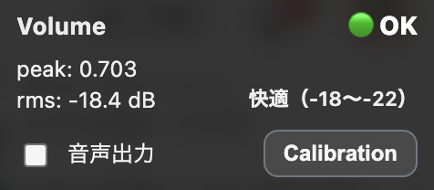

# YouTube Volume Checker

YouTube で再生中の動画や配信の音声を解析し、  
**音量が適切か・小さすぎないか・大きすぎないか・音割れの危険がないか**を  
ページ右上の小さなオーバーレイでリアルタイムに表示する Chrome 拡張です。

配信の事前チェック、視聴中の音量確認、トラブル防止の目安として使うことを想定しています。

---

## 主な機能

- YouTube の **現在のタブ** の音声をチェック
- 直近 10 秒間の音量をもとに状態を判定
- 画面右上に常時表示されるコンパクトなオーバーレイ
- 数値（peak / dB）と、わかりやすいステータス表示
- 音声出力を ON / OFF できるトグル  
  （解析は続けたまま、音だけをミュート可能）

---

## 表示例

  

---

## 表示されるステータス

優先順位：**危険 → 音量注意 → 無音 → 小さい / 大きい → OK**

- 🔴 **危険**  
  音割れに近いレベルの非常に大きな音を検知したとき

- 🟡 **音量注意**  
  大きめの音が短時間でも続いているとき

- 🟣 **無音**  
  ほぼ音が出ていない状態  

- 🟡 **小さい**  
  全体的に音量が小さめの状態

- 🟡 **大きい**  
  全体的に音量が大きめの状態

- 🟢 **OK**  
  特に問題のない音量です

---

## 表示される数値について

- **peak**  
  瞬間的な最大音量（0〜1）

- **rms (dB)**  
  平均的な音量レベル

- **快適（-18〜-22）**  
  一般的に聞きやすいとされる音量の目安範囲  
  ※配信ジャンルや視聴環境によって適正値は変わります

---

## 使い方

1. Chrome で YouTube を開き、動画や配信を再生します
2. 拡張機能のアイコンをクリックして開始します
3. 画面右上に音量チェック用のオーバーレイが表示されます
4. 必要に応じて「音声出力」トグルで音を ON / OFF できます  
   （デフォルトでは OFF です）
5. もう一度拡張アイコンをクリックすると停止します

---

## キャリブレーション（音量補正）について

OS やブラウザ、デバイスの違いにより、  
**同じ YouTube 動画でも音量の数値表示が環境ごとに少しずれる**ことがあります。

その差を補正するために、この拡張には **キャリブレーション（校正）機能**があります。

### キャリブレーションでできること

- 自分の環境に合わせて **音量表示の基準を調整**
- Windows / Mac などの環境差を吸収
- 以降の判定（OK / 小さい / 大きい など）を、より正確に表示

※これは **ブラウザ内での相対補正**です。  
実際の音圧（dB SPL）を測定するものではありません。

---

### キャリブレーションの使い方

1. YouTube の動画や配信を開き、拡張を有効にします
2. オーバーレイ右側の **「Calibration」ボタン**を押します
3. 表示される案内に従い、  
   **動画を一時停止するか、音声をミュート**してください
4. **「Calibration実行」ボタン**を押すと、校正が始まります
5. 数秒後に「Calibration完了」と表示されれば完了です

校正が終わると、以降の音量表示には  
**自動的に補正値が反映**されます。

---

### キャリブレーション時の注意

- 校正中は **動画の音が混ざらない状態**にしてください  
  （一時停止またはミュート推奨）
- 校正は何度でもやり直せます
- 普段と大きく異なる視聴環境（ヘッドホン／スピーカー変更など）では  
  再度校正することをおすすめします

---

### Mac / Windows の扱いについて

- Mac 環境では、校正後でも **補正値が ±0.5 dB 程度になることがあります**
- その程度の差は誤差として扱われ、  
  実用上は **0 dB（基準）として問題ありません**
- Windows 環境では、校正によって差が大きく改善されることがあります

---

## 対応サイト

- YouTube  
  - `youtube.com`
  - `*.youtube.com`

他のサイトでは動作しません。

---

## 注意（判定がブレやすいケース）

以下のような用途では、判定が参考程度になる場合があります。

- ゲーム配信や映画など、意図的に音量差が大きいコンテンツ
- 効果音や爆発音など、瞬間的な大音量が頻繁に入る動画
- 音楽制作・ミキシングなど、精密な音量管理が必要な用途

この拡張は **日常的な視聴・配信確認向けの目安ツール**です。

---

## インストール方法（開発版）

1. GitHub の [Releases](https://github.com/nyumen/youtube-volume-checker/releases) から zip ファイルをダウンロードして解凍します
2. Chrome で `chrome://extensions` を開きます
3. 右上の「デベロッパーモード」を ON にします
4. 「パッケージ化されていない拡張機能を読み込む」から  
   解凍したフォルダを選択します

---

## プライバシーについて

- 音声データを保存・送信することはありません
- すべての処理はブラウザ内で完結します
- 個人情報を収集することはありません

---

## ライセンス

MIT License
