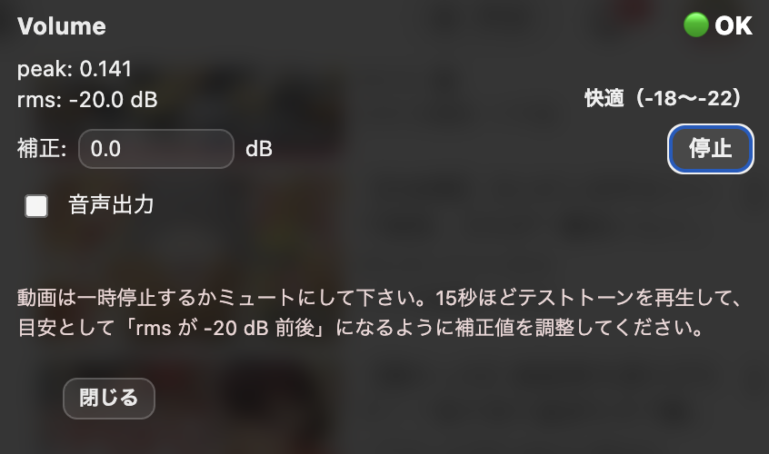

# YouTube Volume Checker

YouTube で再生中の動画や配信の音声を解析し、  
**音量が適切か・小さすぎないか・大きすぎないか・音割れに近い状態が続いていないか**を  
ページ右上の小さなオーバーレイでリアルタイムに表示する Chrome 拡張です。

配信の事前チェック、視聴中の音量確認、トラブル防止の目安として使うことを想定しています。

---

## 主な機能

- YouTube の **現在のタブ** の音声をチェック
- 直近 10 秒間の音量をもとに状態を判定
- 画面右上に常時表示されるコンパクトなオーバーレイ
- 数値（peak / dB）と、わかりやすいステータス表示
- **音声出力 ON / OFF トグル**  
  （解析は続けたまま、音だけをミュート可能）  
  ※この設定は保存され、次回起動時も引き継がれます
- **dB 補正値の手動入力**（常時表示）  
  ※補正値は保存され、次回起動時も引き継がれます
- **テストトーン再生**（補正値調整の目安）

---

## 表示例

通常画面

  

テストトーン出力時

  

---

## 表示されるステータス

優先順位：**音量注意 → 無音 → 小さい / 大きい → OK**

- 🟡 **音量注意**  
  大きめの音が短時間でも続いているとき（音割れの手前の注意レベル）

- 🟣 **無音**  
  ほぼ音が出ていない状態  
  （一時停止やミュート時に「小さい」になりにくいように判定しています）

- 🟡 **小さい**  
  全体的に音量が小さめの状態

- 🟡 **大きい**  
  全体的に音量が大きめの状態

- 🟢 **OK**  
  特に問題のない音量です

---

## 表示される数値について

- **peak**  
  瞬間的な最大音量（0〜1）

- **rms (dB)**  
  平均的な音量レベル（直近 10 秒の窓で算出）

- **快適（-18〜-22）**  
  一般的に聞きやすいとされる音量の目安範囲  
  ※配信ジャンルや視聴環境によって適正値は変わります

---

## 使い方

1. Chrome で YouTube を開き、動画や配信を再生します
2. 拡張機能のアイコンをクリックして開始します
3. 画面右上に音量チェック用のオーバーレイが表示されます
4. 必要に応じて以下を操作します
   - 「音声出力」トグル：音を ON / OFF（解析は継続）
   - 「補正」入力：表示のズレが気になる場合に dB を加算/減算
5. もう一度拡張アイコンをクリックすると停止します

---

## 補正（dB）の考え方

OS やブラウザ、デバイスの違いにより、  
**同じ YouTube 動画でも音量の数値表示が環境ごとに少しずれる**ことがあります。

この拡張では「自動補正」ではなく、  
**手動で補正値（dB）を入力して調整**できる方式を採用しています。

- 例：表示が小さめに感じる → 補正を `+2.0 dB` にする  
- 例：表示が大きめに感じる → 補正を `-2.0 dB` にする  

※この補正は **ブラウザ内の相対補正**です。  
実際の音圧（dB SPL）を測定するものではありません。

---

## テストトーン（補正調整の目安）

オーバーレイ右側の **「テストトーン」** ボタンで、調整用のテスト音を再生できます。

テストトーン再生時は、オーバーレイ下部にメッセージが表示されます：

- 動画は一時停止して下さい。  
  15秒ほどテストトーンを再生し、目安として「rms が -20 dB 前後」になるように補正値を調整してください。

### 使い方のコツ
- テストトーン中は、動画音が混ざらないよう **一時停止**がおすすめです
- 値は立ち上がり直後よりも、少し待つと安定します（窓が 10 秒のため）
- 調整できたら「停止」を押して終わりです

---

## 対応サイト

- YouTube  
  - `youtube.com`
  - `*.youtube.com`

他のサイトでは動作しません。

---

## 注意（判定がブレやすいケース）

以下のような用途では、判定が参考程度になる場合があります。

- ゲーム配信や映画など、意図的に音量差が大きいコンテンツ
- 効果音や爆発音など、瞬間的な大音量が頻繁に入る動画
- 音楽制作・ミキシングなど、精密な音量管理が必要な用途

この拡張は **日常的な視聴・配信確認向けの目安ツール**です。

---

## インストール方法（開発版）

1. GitHub の [Releases](https://github.com/nyumen/youtube-volume-checker/releases) から zip ファイルをダウンロードして解凍します
2. Chrome で `chrome://extensions` を開きます
3. 右上の「デベロッパーモード」を ON にします
4. 「パッケージ化されていない拡張機能を読み込む」から  
   解凍したフォルダを選択します

---

## プライバシーについて

- 音声データを保存・送信することはありません
- すべての処理はブラウザ内で完結します
- 個人情報を収集することはありません

---

## ライセンス

MIT License
